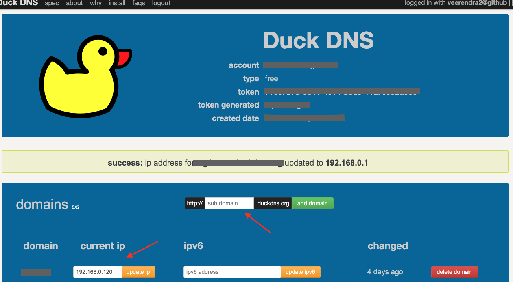
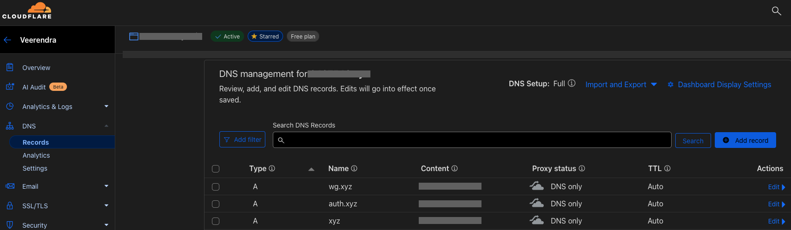
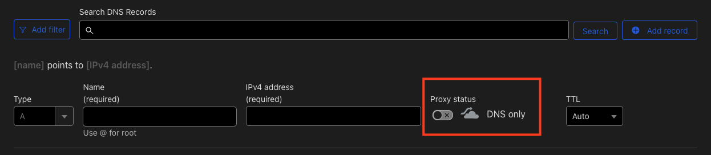
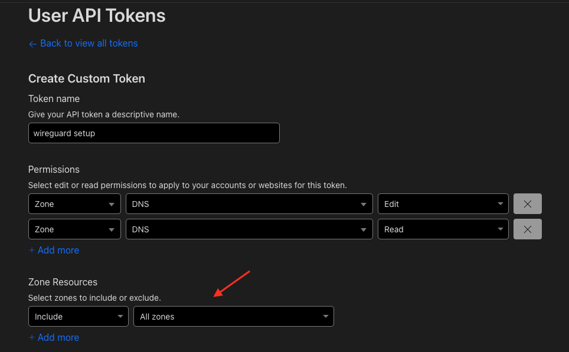
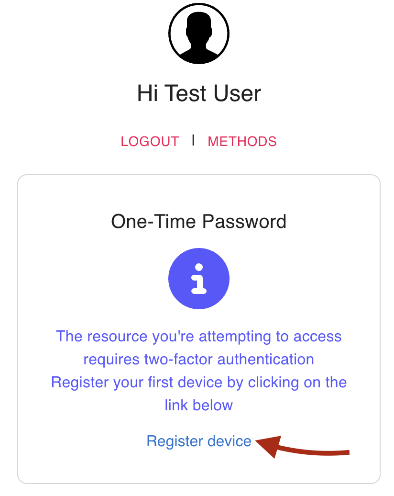
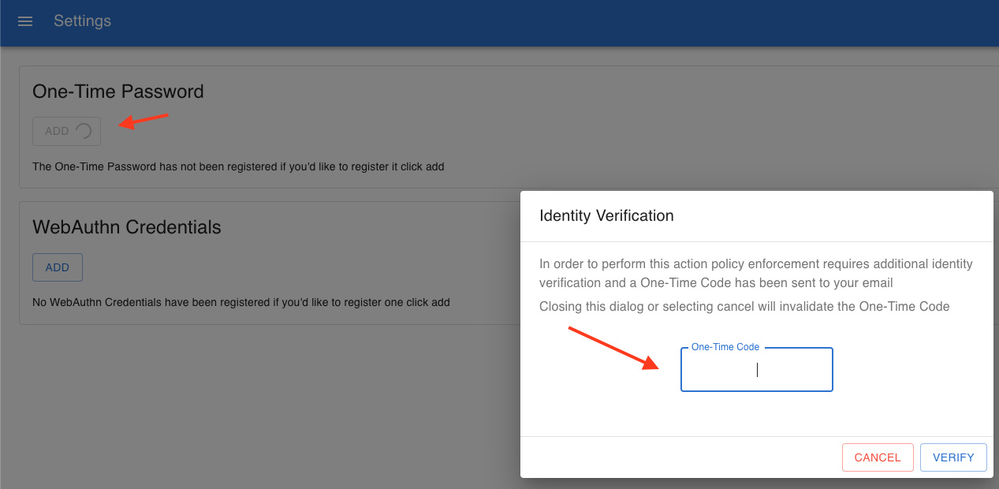
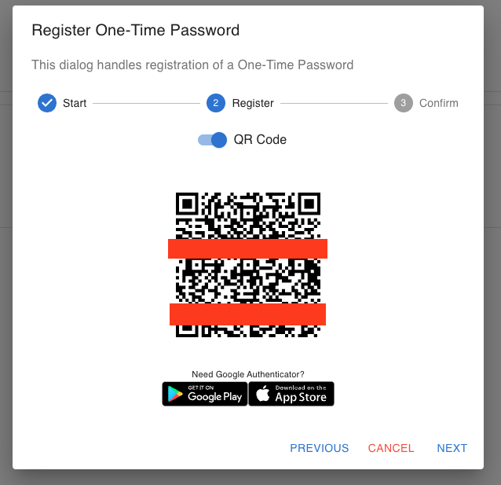
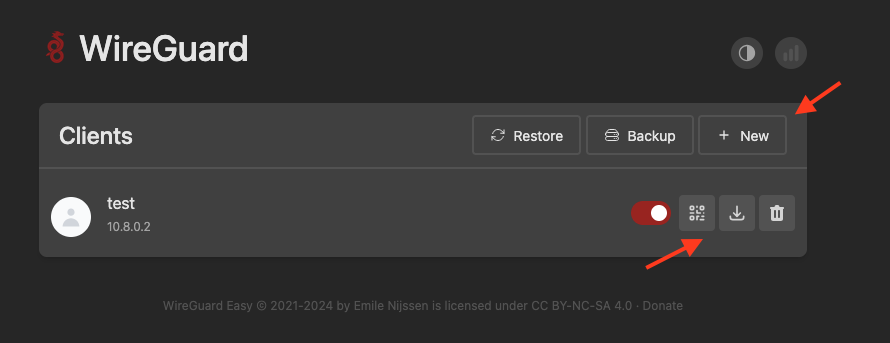

# WireGuard + Traefik + Authelia

Docker Compose stack to deploy a WireGuard VPN server ([wg-easy](https://github.com/wg-easy/wg-easy)), [Traefik](https://github.com/traefik/traefik) as a reverse proxy to access the `wg-easy` UI, and [Authelia](https://github.com/authelia/authelia) for authentication.

<p align="center">
    <a href="https://www.wireguard.com/">
        
    </a>&nbsp;&nbsp;&nbsp;&nbsp;&nbsp;&nbsp;&nbsp;
    <a href="https://doc.traefik.io/traefik/">
        
    </a>&nbsp;&nbsp;&nbsp;&nbsp;&nbsp;&nbsp;&nbsp;
    <a href="https://www.authelia.com/docs/">
        
    </a>&nbsp;&nbsp;&nbsp;&nbsp;&nbsp;&nbsp;&nbsp;
    <a href="https://containrrr.dev/watchtower/">
        
    </a>
</p>

## Deployment Guide

### Preparation

1. Ensure [Docker](https://docs.docker.com/engine/install/) and [Docker Compose plugin](https://docs.docker.com/compose/install/linux/) are installed.
2. Download the latest version of the source code from the release page:

   ```bash
   RELEASE=0.0.1
   curl -L -o wireguard-traefik-authelia-${RELEASE}.zip https://github.com/lexmephi/wireguard-traefik-authelia/archive/refs/tags/${RELEASE}.zip
   unzip wireguard-traefik-authelia-${RELEASE}.zip
   cd wireguard-traefik-authelia-${RELEASE}
   ```

3. Generate a password hash for users in Authelia:

   ```bash
   docker run --rm authelia/authelia:latest \
      authelia crypto hash generate argon2 \
      --password 'YOUR_PASSWORD'
   ```

4. Update the Authelia users configuration in [`./config/users_database.yml`](./config/users_database.yml):

   ```yaml
   users:
     your-user-name:
       disabled: false
       displayname: "Your Display Name"
       password: "<generated-password-hash>"
       email: "root@localhost"
   ```

5. Open the following ports on your server for the WireGuard stack:
   - 80 (TCP)
   - 443 (TCP)
   - 22 (TCP)
   - 51820 (UDP)

### Deploying the Stack

This setup has been tested with DuckDNS and Cloudflare. It should work with other DNS providers with appropriate configurations.

#### DuckDNS

1. Log in to [DuckDNS](https://www.duckdns.org/) and retrieve your token.
2. Create a subdomain and add your server's IP address.

   <p align="center">
     
   </p>

3. Export the required environment variables and start the Docker stack:

   ```bash
   export MY_PROVIDER="duckdns"
   export MY_DOMAIN="YOUR_SUB_DOMAIN.duckdns.org"
   export DUCKDNS_TOKEN="MY_DUCKDNS_TOKEN"

   docker compose up -d
   ```

#### Cloudflare

1. Log in to [Cloudflare](https://dash.cloudflare.com) and navigate to your domain.
2. Click on "DNS" and add the following subdomains as "A" records, pointing to your server's IP address:

   - `wg.<YOUR_SUB_DOMAIN>`
   - `auth.<YOUR_SUB_DOMAIN>`
   - `<YOUR_SUB_DOMAIN>`

   For example, if `<YOUR_SUB_DOMAIN>` is `xyz`, the records should be configured as shown below:

   <p align="center">
       
   </p>

   **Note:** Ensure that Cloudflare proxy is disabled while adding these subdomains, as shown below:

   <p align="center">
      
   </p>

3. To generate a Cloudflare API token:

   - Go to "Profile" → "API Token" → Click "Create Token".
   - Scroll down and click "Get started" under "Custom token".
   - Assign the necessary permissions.

   <p align="center">
     
   </p>

4. Export the required environment variables and start the Docker stack:

   ```bash
   export MY_PROVIDER="cloudflare"
   export MY_DOMAIN="YOUR_SUB_DOMAIN.YOUR_DOMAIN_NAME.com"
   export CLOUDFLARE_DNS_API_TOKEN="MY_CLOUDFLARE_TOKEN"

   docker compose up -d && watch cat config/notification.txt
   ```

### Post-Deployment Setup

1. Once the stack is running, visit `wg.${MY_DOMAIN}`, log in, and register.

   <p align="center">
     
   </p>

2. After logging in, click "ADD" to set up OTP authentication.

   <p align="center">
     
   </p>

3. Retrieve the initial 2FA code from `config/notification.txt`.

   ```bash
   cat config/notification.txt
   ```

   **Example Output:**

   ```
   Date: 2024-07-21 14:55:11 UTC
   Recipient: Test User <authelia@authelia.com>
   Subject: Confirm your identity

   To confirm your identity, use the following code: TXQAT55T
   ```

4. Register the OTP in your preferred authenticator app.

   <p align="center">
     
   </p>

5. Log in, configure your clients, and verify VPN connectivity via [whoer.net](https://whoer.net/).

   <p align="center">
     
   </p>
